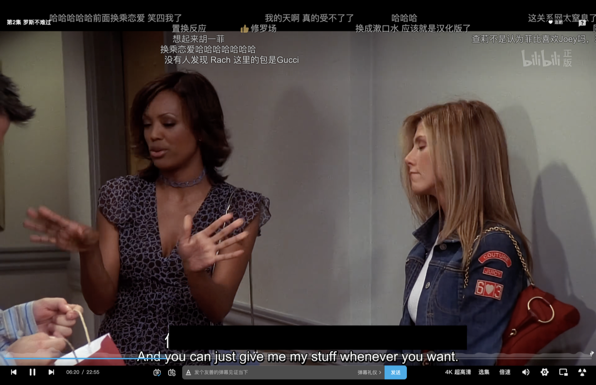
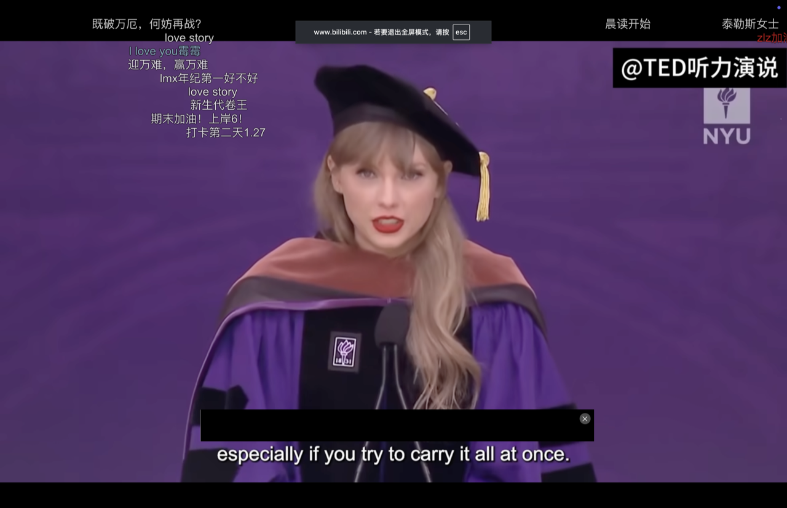
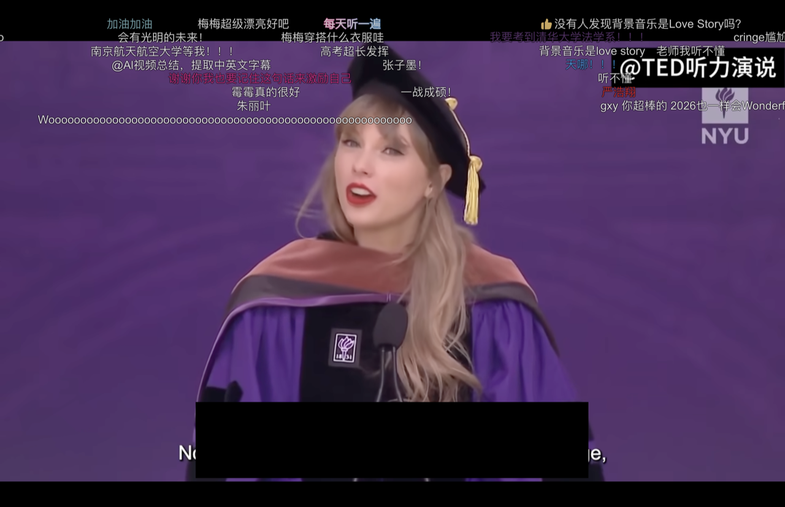
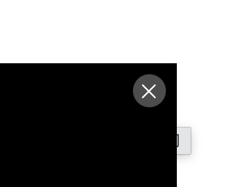

# Subtitle Overlay / 字幕遮挡条

一个极简的 macOS 悬浮小工具：用一条可以拖动、缩放和关闭的纯黑横条，遮住视频里的母语字幕。

A tiny macOS overlay that lets you cover native-language subtitles with a black, draggable, resizable, and dismissible bar.


[](https://www.apple.com/macos/)
[](https://www.swift.org/)
[](https://developer.apple.com/documentation/appkit)
[](LICENSE)

## 为什么做这个？ / Why?

我自己在看《老友记》、Taylor Swift 相关视频和其他英语内容时，经常想暂时遮住中文字幕，让自己先听英语、读英文字幕，再决定什么时候查看中文。这个小工具就是为这个场景做的：简单、快速，不打断观看。

I made this for language-learning sessions. When watching *Friends*, Taylor Swift videos, or other English content, I often want to hide Chinese subtitles temporarily so I can listen first, read the English captions, and reveal the translation only when I really need it.

它也可以用于日语、韩语、西班牙语等其他语言。只要视频里有一层你想暂时隐藏的字幕，就可以把遮挡条放到对应位置。

It also works for Japanese, Korean, Spanish, and other languages. If there is a subtitle layer you want to hide for a while, move the overlay over it.

## Shadowing 学习方式

一个很自然的练习流程是：

1. 播放目标语言字幕，把母语字幕遮住。
2. 先听一遍，尝试理解句子。
3. 暂时移开遮挡条，确认意思或查看生词。
4. 再次播放，跟读或 shadowing。
5. 需要时按 `Esc` 关闭，继续正常观看。

A simple shadowing workflow:

1. Keep the target-language captions visible and cover the native-language captions.
2. Listen once and try to understand the sentence.
3. Move the bar away briefly to check the meaning or a new word.
4. Play it again and shadow the speaker.
5. Press `Esc` whenever you want to close the overlay and continue watching normally.

## 四个使用示例 / Four examples

这些截图来自我平时观看的视频，用来展示工具的使用方式。它们不是软件生成的素材；视频画面、字幕、弹幕、水印和创作者署名仍归原作者及相应平台所有。

These screenshots come from videos I watch and are included only to demonstrate the workflow. The video footage, captions, comments, watermarks, and creator credits belong to their original creators and platforms.

<table>
  <tr>
    <td width="50%">
      <strong>1. 正常遮住《老友记》的字幕</strong><br>
      Cover the subtitle area while watching <em>Friends</em>.
    </td>
    <td width="50%">
      <strong>2. 适用于 Taylor Swift 视频</strong><br>
      Use the same overlay with a different video and subtitle layout.
    </td>
  </tr>
  <tr>
    <td></td>
    <td></td>
  </tr>
  <tr>
    <td>
      <strong>3. 任意调整粗细和大小</strong><br>
      Drag the edges to match a different subtitle position or height.
    </td>
    <td>
      <strong>4. 悬停显示关闭按钮</strong><br>
      Move the pointer to the top-right corner to reveal the close button.
    </td>
  </tr>
  <tr>
    <td></td>
    <td></td>
  </tr>
</table>

特别感谢我平时观看的内容创作者，包括截图中标注的 `@TED听力演说` 以及 Bilibili 上的原视频作者。请在转载或分享截图时保留原有署名，并遵守视频平台和内容创作者的版权规则。

Thank you to the creators whose videos I watch, including `@TED听力演说` shown in one of the screenshots and the original creators on Bilibili. If you reuse or share these screenshots, please keep the original credits and follow the relevant platform and copyright rules.

## 功能 / Features

- 纯黑、不透明的字幕遮挡条 / Solid black, opaque overlay
- 始终位于其他 App 之上，并支持 macOS 全屏空间 / Stays above other apps and joins macOS full-screen Spaces
- 可以从黑色区域任意位置拖动 / Drag from anywhere on the black area
- 可以从窗口边缘自由调整宽度和高度 / Resize from the window edges
- 鼠标移到右上角显示关闭按钮 / Reveal the close button on hover
- 按 `Esc` 快速关闭 / Press `Esc` to close quickly
- 自动记住上次的位置和尺寸 / Restores the last position and size
- 不读取视频内容、不联网、不需要辅助功能权限 / No video analysis, network access, or accessibility permission required

## 使用 / Usage

下载或克隆仓库后，双击：

After downloading or cloning the repository, double-click:

```text
outputs/SubtitleOverlay.app
```

第一次启动时，遮挡条会出现在屏幕下方字幕区域。拖动和调整到合适位置后，下一次启动会恢复上次的状态。

On first launch, the bar appears near the lower subtitle area. After you position and resize it, the next launch restores that state.

## 从源码构建 / Build from source

需要 macOS、Xcode Command Line Tools 和 Swift 6：

Requires macOS, Xcode Command Line Tools, and Swift 6:

```bash
swift test
bash scripts/package-app.sh
open outputs/SubtitleOverlay.app
```

## 注意 / Limitations

这个工具只是把一个窗口放在视频字幕上方，不会修改、删除或识别视频里的字幕。某些 DRM 视频、受保护的播放表面或系统级安全界面可能不允许第三方窗口覆盖，这是 macOS 的系统限制。

This tool places a window over the subtitle area; it does not modify, remove, or recognize subtitles inside the video. Some DRM-protected video surfaces and system-level secure interfaces may prevent third-party overlays, which is a macOS limitation.

## 许可证 / License

这是一个公开的个人小项目，欢迎语言学习者试用、提出建议和贡献改进。本项目使用 MIT License，允许你使用、复制、修改、合并、发布、分发、再许可和销售软件副本，但请保留原作者版权和许可声明。完整条款见 [LICENSE](LICENSE)。

This is a public personal project for language learners. Feedback and improvements are welcome. The project is released under the MIT License, which permits use, copying, modification, merging, publishing, distribution, sublicensing, and sale of copies, provided that the original copyright and permission notice are retained. See [LICENSE](LICENSE) for the full text.
